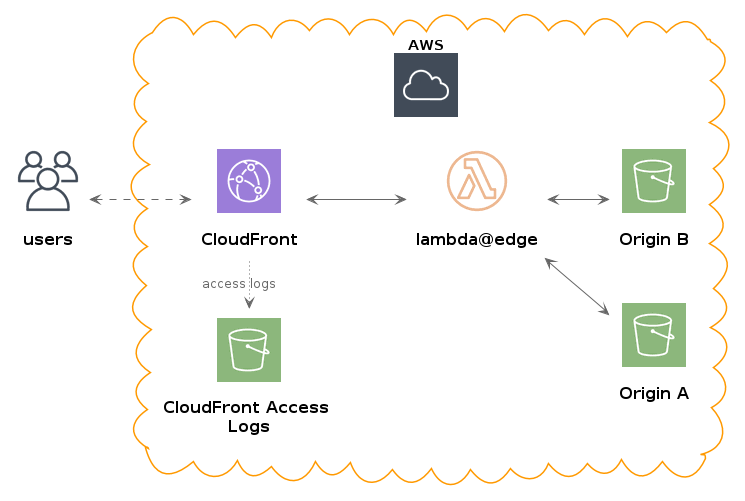
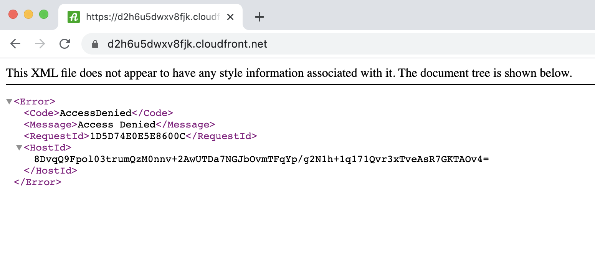
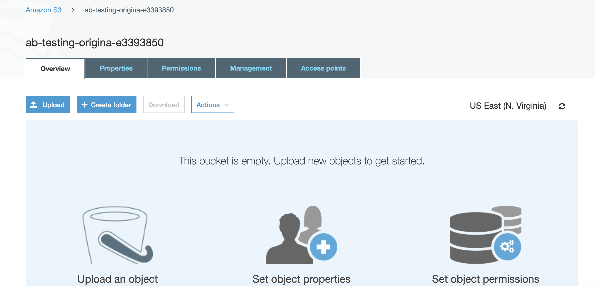
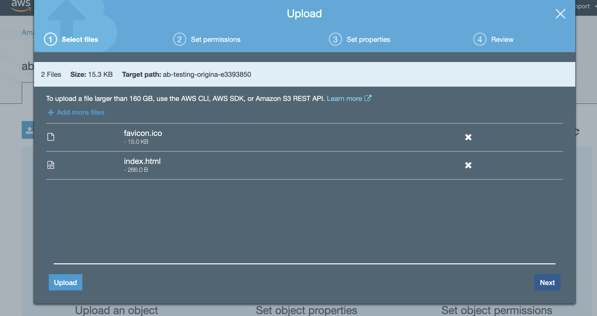
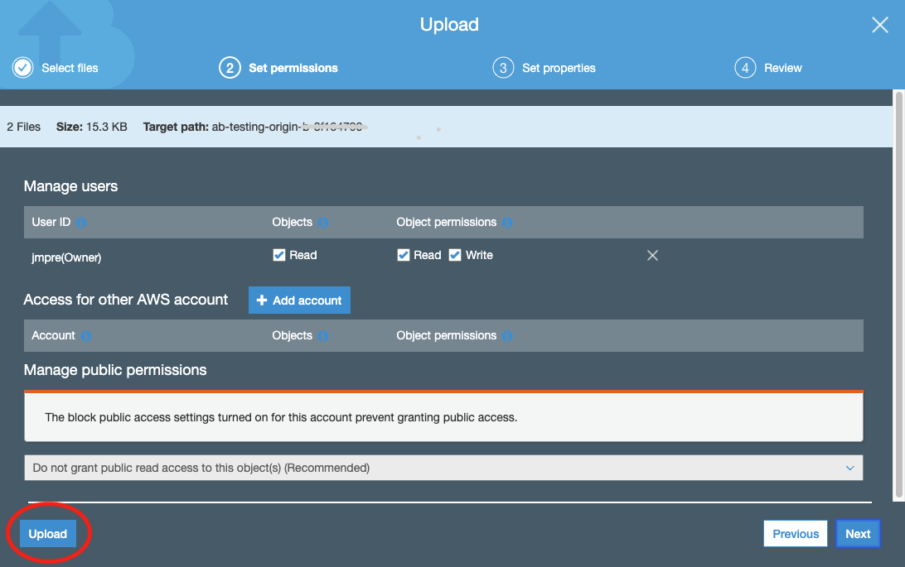
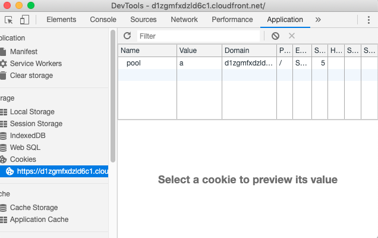

# A/B testing with lambda@edge

In this lab we will learn how we can use lambda@edge functions to serve different variants of the same static resources from a CloudFront distribution.

This ability can be used to enable A/B testing of staticly deployed websites without resorting to complex and resource intensive conditional server-side rendering of content.

Headings with the &#9432; symbol indicate Information only sections of this README

Those with the &#9755; symbol indicate action to be taken to complete the lab


## Pre-requisites

1. An AWS Account
2. AWS CLI
3. AWS SAM (Serverless Application Model) CLI
4. A local copy of this repository (`git clone https://github.com/justasitsounds/lambda-edge-lab.git`)

Follow the instructions for your platform [here](https://docs.aws.amazon.com/serverless-application-model/latest/developerguide/serverless-sam-cli-install.html) to install the AWS SAM CLI.


## &#9432; What are we building?

Our imaginary scenario is that our colleagues in the marketing team have some ideas about improving customer engagement on our company's website by tweaking some of the design features of our site

The functionality we need:
1. Randomly split unassigned traffic into two groups or pools
2. Serve two different variants of content from either of two origin S3 buckets (the `A` or `B` bucket)
3. Ensure that subsequent requests from the same clients will be served the same content that they first received (session stickyness)
4. Record and compare the impact the changes make to the customer engagement


To get started we will deploy:
  - the CloudFront distribution 
  - an S3 bucket to retain the CloudFront access logs
  - a CloudFront Origin Access Identity - a special CloudFront user that is associated with our CloudFront distribution (https://docs.aws.amazon.com/AmazonCloudFront/latest/DeveloperGuide/private-content-restricting-access-to-s3.html)
  - the two origin S3 buckets with attached bucket policies that grants the Origin Access Identity `s3:getObject` permission on all the resources within the bucket





There is a SAM template in this solution `template.yml` that we will use to deploy this stack. SAM templates are an extension of AWS CloudFormation templates that are focussed on providing a shorthand way of deploying AWS Lambda functions.

```yaml
AWSTemplateFormatVersion: '2010-09-09'
Transform: AWS::Serverless-2016-10-31
Description: A/B testing using cloudfront and lambda@edge

Resources:

  OriginAccessIdentity:
    Type: AWS::CloudFront::CloudFrontOriginAccessIdentity
    Properties:
      CloudFrontOriginAccessIdentityConfig:
        Comment: Origin Access Identity for lambda@edge dev lab
  
  LogBucket:
    Type: "AWS::S3::Bucket"

  CFDistribution:
    Type: AWS::CloudFront::Distribution
    Properties:
      DistributionConfig:
        Logging:
          Bucket: !GetAtt LogBucket.DomainName
          IncludeCookies: true
        Enabled: true
        DefaultRootObject: index.html
        Comment: 'AB testing Cloudfront distribution' 
        Origins:
          - Id: s3
            DomainName: !GetAtt OriginABucket.DomainName
            S3OriginConfig:
              OriginAccessIdentity: !Join [ "/", [ origin-access-identity, cloudfront, !Ref OriginAccessIdentity ]]
        DefaultCacheBehavior:
          TargetOriginId: s3
          ForwardedValues:
            QueryString: false
            Cookies:
              Forward: whitelist
              WhitelistedNames:
                - pool
          ViewerProtocolPolicy: redirect-to-https
          DefaultTTL: 30
          MinTTL: 0
          AllowedMethods:
            - HEAD
            - GET
          CachedMethods:
            - HEAD
            - GET
          SmoothStreaming: false
          Compress: true
              
  OriginABucket:
    Type: AWS::S3::Bucket
    Properties:
      BucketName: !Join
      - "-"
      - - "ab-testing-origin-a"
        - !Select
          - 0
          - !Split
            - "-"
            - !Select
              - 2
              - !Split
                - "/"
                - !Ref "AWS::StackId"
      AccessControl: Private
      Tags:
      - Key: purpose
        Value: lab
      - Key: project
        Value: lambda-edge-ab

  OriginBBucket:
    Type: AWS::S3::Bucket
    Properties:
      BucketName: !Join
      - "-"
      - - "ab-testing-origin-b"
        - !Select
          - 0
          - !Split
            - "-"
            - !Select
              - 2
              - !Split
                - "/"
                - !Ref "AWS::StackId"
      AccessControl: Private
      Tags:
      - Key: purpose
        Value: lab
      - Key: project
        Value: lambda-edge-ab

  OriginAAccessBucketPolicy:
    Type: AWS::S3::BucketPolicy
    Properties:
      Bucket:
        Ref: OriginABucket
      PolicyDocument:
        Version: '2008-10-17'
        Id: PolicyForCloudFrontPrivateContentA
        Statement:
        - Sid: '1'
          Effect: Allow
          Principal:
            CanonicalUser: !GetAtt OriginAccessIdentity.S3CanonicalUserId
          Action: s3:GetObject
          Resource: 
            - !Join [ "", [ "arn:aws:s3:::", !Ref OriginABucket, "/*"]]

  OriginBAccessBucketPolicy:
    Type: AWS::S3::BucketPolicy
    Properties:
      Bucket:
        Ref: OriginBBucket
      PolicyDocument:
        Version: '2008-10-17'
        Id: PolicyForCloudFrontPrivateContentB
        Statement:
        - Sid: '1'
          Effect: Allow
          Principal:
            CanonicalUser: !GetAtt OriginAccessIdentity.S3CanonicalUserId
          Action: s3:GetObject
          Resource: 
            - !Join [ "", [ "arn:aws:s3:::", !Ref OriginBBucket, "/*"]] 

Outputs:
    CFDistribution: 
      Description: Cloudfront Distribution Domain Name
      Value: !GetAtt CFDistribution.DomainName

    BucketADomain:
      Description: Regional Domian name of the A bucket
      Value: !GetAtt OriginABucket.RegionalDomainName

    BucketBDomain:
      Description: Regional Domian name of the A bucket
      Value: !GetAtt OriginBBucket.RegionalDomainName

    LogBucketDomain:
      Description: Regional Domian name of the log bucket
      Value: !GetAtt LogBucket.RegionalDomainName

```

## &#9755; 1. Deploy the CloudFront stack

Open your terminal and change the working directory to the solution root and then enter this command to deploy this CloudFormation stack

```bash
sam deploy --stack-name lambda-edge-dist --region us-east-1 -g
```

The CLI will ask a series of questions as you deploy for the first time. 

```bash
	Stack Name [lambda-edge-dist]:
	AWS Region [us-east-1]:
	#Shows you resources changes to be deployed and require a 'Y' to initiate deploy
	Confirm changes before deploy [y/N]: N
	#SAM needs permission to be able to create roles to connect to the resources in your template
	Allow SAM CLI IAM role creation [Y/n]: Y
	Save arguments to samconfig.toml [Y/n]: Y
```

Just hit `enter` for each question to accept the default option.

It will take a little while (up to 10 minutes) for the stack to complete deployment. When it does you should see output similar to the following in your terminal - listing the outputs of the cloudformation stack you have deployed:

```bash
Stack lambda-edge-dist outputs:
-----------------------------------------------------------------------------------------------------------------------
OutputKey-Description                                       OutputValue
-----------------------------------------------------------------------------------------------------------------------
CFDistribution - Cloudfront Distribution Domain Name        d2h6u5dwxv8fjk.cloudfront.net
LogBucketDomain - Regional Domian name of the log bucket    lambda-edge-dist2-logbucket-7rmi3pxv2h0v.s3.us-
                                                            east-1.amazonaws.com
DistributionID - Cloudfront Distribution ID                 E2S5BSZ6ZQX7GF
BucketADomain - Regional Domian name of the A bucket        ab-testing-origina-e3393850.s3.us-east-1.amazonaws.com
BucketBDomain - Regional Domian name of the A bucket        ab-testing-originb-e3393850.s3.us-east-1.amazonaws.com
-----------------------------------------------------------------------------------------------------------------------

Successfully created/updated stack - lambda-edge-dist in us-east-1
```


So, now we have a cloudfront distribution that is set to serve content from the `A` S3 bucket. The subdomain name of your new CloudFront distribution is randomly generated. To find out what the full domain name is, either refer to the OutputValue that corresponds to the OutputKey `CFDistribution` in the return from the `sam deploy` command described above, or find the deployed CloudFormation stack in your AWS console called `lambda-edge-dist` (make sure you are looking at the N. Virginia region) and find it listed under the output tab there. 


Point your browser to your new CloudFront distribution domain name and you'll see:





This is because there is no content in the bucket to serve. Or rather the cloudfront distribution is trying to serve the default root object (index.html) from the S3 bucket, but it's not there.


## &#9755; 2. Upload your `A` content using the console

In the content folder of this solution you will see two subfolders: `origin-a` and `origin-b` with two different versions of a single web-page (index.html)

```
── content
│   ├── origin-a
│   │   ├── favicon.ico
│   │   └── index.html
│   └── origin-b
│       ├── favicon.ico
│       └── index.html
```

Upload these to the corresponding origin buckets:


1. Navigate to the S3 service dashboard in the AWS console (https://s3.console.aws.amazon.com/s3/home)
2. Find the `A` bucket - it's name should start with `ab-testing-origin-a` 
3. open the origin A bucket by clicking on it's name 
4. Upload the `index.html` and `favicon.ico` files from the local `content/origin-a` folder. 
Once you have selected the files to upload, simply click the 'Upload' button on the left hand side of the dialog to accept the default permissions and properties for those files


Once this is done, check that you can see the `A` content being served from your CloudFront domain by pointing your browser to the Cloudfront distribution dmain name again.


## &#9755; 3. Upload your `B` content using the console

Repeat the steps listed above to upload the files `content/origin-b/favicon.ico` and `content/origin-a/index.html` to the `B` content bucket (the name starts with `ab-testing-origin-b`)

If you point your browser at the CloudFront distribution domain again, you will only see the `A` content being served. 

In order to change the origin for this CloudFront distribution as we want, we'll need to add some lambda@edge functions to the distribution.


## &#9432; How do lambda@edge functions work?

lambda@edge functions can be triggered by 4 different CloudFront events that correspond to the following stages of a Cloudfront content request:  


  -   After CloudFront receives a request from a viewer (viewer request)
  -   Before CloudFront forwards the request to the origin (origin request)
  -   After CloudFront receives the response from the origin (origin response)
  -   Before CloudFront forwards the response to the viewer (viewer response)


The CloudFront distribution has been configured to forward `pool` cookies to the Origin - meaning that the `pool` cookie is part of the cache key. This allows us to utilise the caching abilities of CloudFront so that subsequent requests that include a `pool` cookie (`pool=a` or `pool=b`), will fetch the same content from the edge cache without making a request to the Origin.


### &#9432; Viewer request function - assigning new visitors to content pool `A` or `B`

This function intercepts the viewer request before it is routed to the Cloudfront cache. The code simply adds a `pool` cookie, value: `pool=a` or `pool=b` to the request header if one is not already present. Users without an existing pool cookie are randomly assigned either `pool=a` or `pool=b` with an equal probability (50/50) of being assigned either.


### &#9432; Origin Request function:

This function changes the origin bucket location in the request to point to either origin `A` or origin `B` depending on the value of the `pool` cookie.


### &#9432; Origin Response function:

Adds a `Set-Cookie` header to set the `pool` cookie to match the origin from where the content was served - ensuring that clients that made a requests without a `pool` cookie are instructed to store and send the pool cookie value that matches the origin for subsequent requests.


## &#9755; 4. Write the viewer request Lambda@edge function

Copy and paste the following code into the `edge-functions/viewerrequest.js` file in this solution and save.

```javascript
'use strict';

// the `pool` cookie designates the user pool that the request belongs to
const cookieName = 'pool';

// returns cookies as an associative array, given a CloudFront request headers array
const parseCookies = require('./common.js').parseCookies;

// returns either 'a' or 'b', with a default probability of 1:1
const choosePool = (chance = 2) => Math.floor(Math.random()*chance) === 0 ? 'b' : 'a';

//if the request does not have a pool cookie - assign one
exports.handler = (event, context, callback) => {
    const request = event.Records[0].cf.request;
    const headers = request.headers;
    const parsedCookies = parseCookies(headers);

    if(!parsedCookies || !parsedCookies[cookieName]){
        let targetPool = choosePool(); //pass a Number as argument to change the chance that user is assigned to Pool 'a' or 'b' 
        headers['cookie'] = [{ key: 'cookie', value: `${cookieName}=${targetPool}`}]
    }

    callback(null, request);
};
```

## &#9755; 5. update the shared origin_config.js configuration file

Both the `origin_request` and `origin_response` lambda@edge functions depend on a common configuration file that holds the bucket names for the `A` and `B` S3 buckets.

You'll need to update this file with the names of the `A` and `B` origin buckets that were created when you first deployed the solution stack. You can find this name by either looking at the output of the `sam deploy` function if you still have that open in your terminal window: IE:


or by looking at the outputs in the `lambda-edge-dist` stack in the Cloudformation console.

In this deployment example, the name of the `A` bucket is: `ab-testing-origin-a-01207890` and the name of the `B` bucket is: `ab-testing-origin-b-01207890` (note that the name is the first segment of the bucket domain name)

Using these two values, update the code in `edge-functions/origins_config.js` to match. So for the deployment shown above the file would change from:

```javascript
module.exports = {
    a:'<REPLACE WITH THE NAME OF YOUR ORIGIN A BUCKET>',
    b:'<REPLACE WITH THE NAME OF YOUR ORIGIN B BUCKET>'
};
```

to

```javascript
module.exports = {
    a:'ab-testing-origin-a-01207890',
    b:'ab-testing-origin-b-01207890'
};
```


## &#9755; 6. Write the origin request Lambda@edge function

Copy and paste the following code into the `edge-functions/originrequest.js` file in this solution and save.

```javascript
'use strict';

// the S3 origins that correspond to content for Pool A and Pool B
const origins = require('./origins_config.js');
const parseCookies = require('./common.js').parseCookies;

// the `pool` cookie determines which origin to route to
const cookieName = 'pool';

// changes request origin depending on value of the `pool` cookie 
exports.handler = (event, context, callback) => {
    const request = event.Records[0].cf.request;
    const headers = request.headers;
    const requestOrigin = request.origin.s3;
    const parsedCookies = parseCookies(headers);

    let targetPool = parsedCookies[cookieName];
    let s3Origin = `${origins[targetPool]}.s3.us-east-1.amazonaws.com`;
    
    requestOrigin.region = 'us-east-1'; 
    requestOrigin.domainName = s3Origin;
    headers['host'] = [{ key: 'host', value: s3Origin }];

    callback(null, request);
};
```

## &#9755; 7. Write the origin response Lambda@edge function

Copy and paste the following code into the `edge-functions/originresponse.js` file in this solution and save.

```javascript
'use strict';

// the S3 origins that correspond to content for Pool A and Pool B
const origins = require('./origins_config.js');

//returns a set-cookie header based on where the content was served from
exports.handler = (event, context, callback) => {

    const response = event.Records[0].cf.response; //response from the origin
    const reqHeaders = event.Records[0].cf.request; //request from cloudfront

    let poolorigin = 'a'; //default origin pool

    if(reqHeaders.origin.s3.domainName.indexOf(origins.b) === 0){
        poolorigin = 'b';
    }
    response.headers['Set-Cookie'] = [{key:'Set-Cookie', value: `pool=${poolorigin}`}];

    callback(null, response);
};
```

## &#9755; 8. update the SAM template to include the lambda@edge functions

Below is the updated SAM template that includes the lambda@edge functions and integrates them with the CloudFront distribution. New sections have comments to show the additions. Copy and paste the following to replace the contents of `template.yml`

```yaml
AWSTemplateFormatVersion: '2010-09-09'
Transform: AWS::Serverless-2016-10-31
Description: A/B testing using cloudfront and lambda@edge

### The Globals section is a SAM specific element that defines the common attributes of the Lambda@Edge functions we are deploying
Globals:
  Function:
    Runtime: nodejs10.x
    Timeout: 5
    AutoPublishAlias: live
###

Resources:

  OriginAccessIdentity:
    Type: AWS::CloudFront::CloudFrontOriginAccessIdentity
    Properties:
      CloudFrontOriginAccessIdentityConfig:
        Comment: Origin Access Identity for lambda@edge dev lab
  
  ### the EdgeFunctionRole is an IAM role that is granted to the Lambda@Edge functions
  EdgeFunctionRole:
    Type: AWS::IAM::Role
    Properties:
      RoleName: !Sub ${AWS::StackName}-edgeFunction
      AssumeRolePolicyDocument:
        Version: 2012-10-17
        Statement:
          Effect: Allow
          Principal:
            Service:
              - lambda.amazonaws.com
              - edgelambda.amazonaws.com
          Action: sts:AssumeRole
      ManagedPolicyArns:
        - arn:aws:iam::aws:policy/service-role/AWSLambdaBasicExecutionRole
        - arn:aws:iam::aws:policy/AWSXrayWriteOnlyAccess
  ###

  ### The Lambda@Edge functions - these require the EdgeFunctionRole
  ViewerRequestLambda:
    Type: AWS::Serverless::Function
    Properties:
      Description: Assigns pool cookie if not present on request
      Role: !GetAtt EdgeFunctionRole.Arn
      CodeUri: ./edge-functions/src/
      Handler: viewerrequest.handler

  OriginRequestLambda:
    Type: AWS::Serverless::Function
    Properties:
      Description: Changes request Origin depending on value of pool cookie
      Role: !GetAtt EdgeFunctionRole.Arn
      CodeUri: ./edge-functions/src/
      Handler: originrequest.handler
        
  OriginResponseLambda:
    Type: AWS::Serverless::Function
    Properties:
      Description: Appends Set-cookie header to match response origin
      Role: !GetAtt EdgeFunctionRole.Arn
      CodeUri: ./edge-functions/src/
      Handler: originresponse.handler
  ###

  LogBucket:
    Type: "AWS::S3::Bucket"

  CFDistribution:
    Type: AWS::CloudFront::Distribution
    Properties:
      DistributionConfig:
        Logging:
          Bucket: !GetAtt LogBucket.DomainName
          IncludeCookies: true
        Enabled: true
        DefaultRootObject: index.html
        Comment: 'AB testing Cloudfront distribution' 
        Origins:
          - Id: s3
            DomainName: !GetAtt OriginABucket.DomainName
            S3OriginConfig:
              OriginAccessIdentity: !Join [ "/", [ origin-access-identity, cloudfront, !Ref OriginAccessIdentity ]]
        DefaultCacheBehavior:
          TargetOriginId: s3
          ForwardedValues:
            QueryString: false
            Cookies:
              Forward: whitelist
              WhitelistedNames:
                - pool
          ViewerProtocolPolicy: redirect-to-https
          DefaultTTL: 30
          MinTTL: 0
          AllowedMethods:
            - HEAD
            - GET
          CachedMethods:
            - HEAD
            - GET
          SmoothStreaming: false
          Compress: true
          ### Lambda Function Associations - associating the functions with the CloudFront request/response events
          LambdaFunctionAssociations:
            - 
              EventType: viewer-request
              LambdaFunctionARN: !Ref ViewerRequestLambda.Version
            - 
              EventType: origin-request
              LambdaFunctionARN: !Ref OriginRequestLambda.Version
            - 
              EventType: origin-response
              LambdaFunctionARN: !Ref OriginResponseLambda.Version
          ###
              
  OriginABucket:
    Type: AWS::S3::Bucket
    Properties:
      BucketName: !Join
      - "-"
      - - "ab-testing-origin-a"
        - !Select
          - 0
          - !Split
            - "-"
            - !Select
              - 2
              - !Split
                - "/"
                - !Ref "AWS::StackId"
      AccessControl: Private
      Tags:
      - Key: purpose
        Value: lab
      - Key: project
        Value: lambda-edge-ab

  OriginBBucket:
    Type: AWS::S3::Bucket
    Properties:
      BucketName: !Join
      - "-"
      - - "ab-testing-origin-b"
        - !Select
          - 0
          - !Split
            - "-"
            - !Select
              - 2
              - !Split
                - "/"
                - !Ref "AWS::StackId"
      AccessControl: Private
      Tags:
      - Key: purpose
        Value: lab
      - Key: project
        Value: lambda-edge-ab

  OriginAAccessBucketPolicy:
    Type: AWS::S3::BucketPolicy
    Properties:
      Bucket:
        Ref: OriginABucket
      PolicyDocument:
        Version: '2008-10-17'
        Id: PolicyForCloudFrontPrivateContentA
        Statement:
        - Sid: '1'
          Effect: Allow
          Principal:
            CanonicalUser: !GetAtt OriginAccessIdentity.S3CanonicalUserId
          Action: s3:GetObject
          Resource: 
            - !Join [ "", [ "arn:aws:s3:::", !Ref OriginABucket, "/*"]]

  OriginBAccessBucketPolicy:
    Type: AWS::S3::BucketPolicy
    Properties:
      Bucket:
        Ref: OriginBBucket
      PolicyDocument:
        Version: '2008-10-17'
        Id: PolicyForCloudFrontPrivateContentA
        Statement:
        - Sid: '1'
          Effect: Allow
          Principal:
            CanonicalUser: !GetAtt OriginAccessIdentity.S3CanonicalUserId
          Action: s3:GetObject
          Resource: 
            - !Join [ "", [ "arn:aws:s3:::", !Ref OriginBBucket, "/*"]] 

Outputs:
    CFDistribution: 
      Description: Cloudfront Distribution Domain Name
      Value: !GetAtt CFDistribution.DomainName

    DistributionID:
      Description: Cloudfront Distribution ID
      Value: !Ref CFDistribution 
 
    BucketADomain:
      Description: Regional Domian name of the A bucket
      Value: !GetAtt OriginABucket.RegionalDomainName

    BucketBDomain:
      Description: Regional Domian name of the A bucket
      Value: !GetAtt OriginBBucket.RegionalDomainName

    LogBucketDomain:
      Description: Regional Domian name of the log bucket
      Value: !GetAtt LogBucket.RegionalDomainName
```


## &#9755; 9. Deploy the updated SAM template

To deploy the updated stack, we just need to invoke the `sam deploy` command again - with specific CAPABILITY_NAMED_IAM capabilites because now our template defines an IAM role: edgeFunctionRole that will be assumed by our lambda@edge functions.

```bash
sam deploy --capabilities CAPABILITY_NAMED_IAM
```

This will take between 5-10 minutes to complete. Once it is finished, you can proceed to the final stage: Testing!

---

## &#9755; Testing


As a quick recap, our requirements are:

1. Randomly split unassigned traffic into two groups or pools
2. Serve two different variants of content from either of two origin S3 buckets (the `A` or `B` bucket)
3. Ensure that subsequent requests from the same clients will be served the same content that they first received (session stickyness)
4. Record and compare the impact the changes make to the customer engagement


To test the first three requirements:

1. Point your browser at the CloudFront distribution
2. You will see either of these two pages:

    

    

3. If you open the dev tools (in Chrome: it's under View > Developer Tools > Developer Tools) and examine the Cookies (Chrome Developer Tools > Application tab, Storage : Cookies) you will see that your browser will now have a `pool` session cookie for the current domain, the value of which will match the Origin that the content was served from:

    

4. Open the Network tab in the developer tools and ensure that the __Preserve log__ checkbox is checked, then refresh the page any number of times. You will see the same content with each page refresh - the `pool` session cookie ensures that your request will be served content from the same origin. If you examine the response headers while you do this (Chrome: Developer Tools : Network tab) you will see a couple of things:
   - The initial response will have a `200` (OK) status code and a custom `X-Cache` header with a value: `Miss from cloudfront` - this is a hint from cloudfront that tells us that this content was fetched directly from the origin, and not served from the cloudfront cache. The matching request will have no `Cookie: pool=[[X]]` header, but the server will add a `Set-Cookie: pool=[[X]]` header to the response - this instructs your browser to create the pool cookie and append it to subsequent requests to the same domain.
   - Subsequent requests will have the `Cookie: pool=[[X]]` header and may have a `304` (Not Modified) status code along with an `X-Cache: Hit from cloudfront` header and an `Age` header - this type of response means a couple of things:
      - [304 - not modified](https://developer.mozilla.org/en-US/docs/Web/HTTP/Status/304). The server (cloudfront) has recognised that the content being requested has not changed since the client last received a valid copy - this is mediated by the `If-Modified-Since` and `If-None-Match` request headers sent by the client. When your browser receieves the `304` response it actually serves the page content from it's internal cache rather than the full content from the server - this is the purpose of 304 responses, they do not contain a message-body for this reason
      - `X-Cache: Hit from cloudfront` - cloudfront has checked the request against it's edge cache - and not the origin. 
      - The `Age` response header tells us how old the cached copy of the content is in seconds. By default this distribution is configured to only keep a copy of the content in it's cache for 30 seconds - the default cache lifetime can be overridden by adding a `max-age` cache-control header to the content in the S3 origin.
        
5. Change the value of the `pool` cookie to the other origin (if it is currently `a`, change it to `b`) and then refresh the page. You will now see the alternate content for the same resource.
6. Delete the `pool` cookie and refresh the browser, you have a 50/50 chance of seeing the alternate content.

To test the last requirement (record and compare the impact the changes make to the customer engagement) you can:

7. [Query the Cloudfront access logs using Athena](https://docs.aws.amazon.com/athena/latest/ug/cloudfront-logs.html). You can segment your user traffic based on the `pool` cookie value in the logs so that you can compare the customer journeys for those customers who received the `A` content and `B` content


---

# Cleaning up

1. Delete all content from the log and origin S3 buckets

    a) Navigate to the S3 dashboard in the console

    b) click on the bucket name for each of the buckets

    c) select all content in the bucket using the radiobuttons and click the 'Delete' button

2. Delete the CloudFormation stack:

    a) Navigate to the CloudFormation dashboard in the S3 console
    
    b) Select the radiobutton for the `lambda-edge-dist` stack and click the 'Delete' button

    c) If there is any content in the the log or origin buckets you will get a DELETE_FAILED status on the cloudformation stack. Delete the content (see above) and try the delete cloudformation stack operation again

